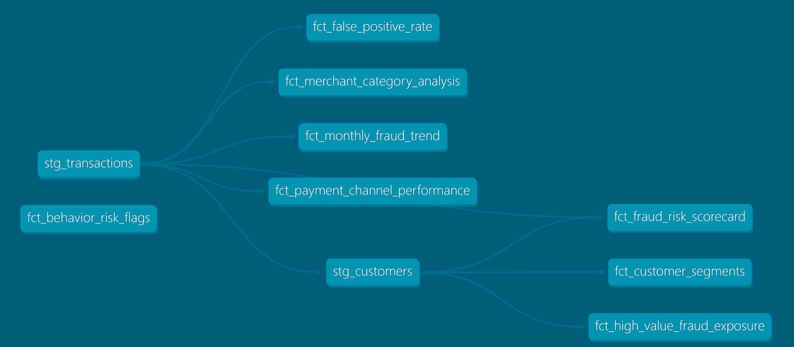

# UAE FinPay Payment Analytics & Fraud Risk Intelligence Engine

---

## Executive Summary

This project delivers a production-ready fraud detection and payment analytics pipeline for UAE FinPay, addressing CBUAE's 2026 AML/CFT and fraud monitoring mandates. Key outcomes:

- **8 dbt mart models** for fraud risk scoring, customer segmentation, and payment channel intelligence
- **High-value customer concentration risk identified:** Top 20% of customers represent 89.69% of total fraud exposure
- **Channel fraud insights:** Bank transfer shows 8.14% fraud rate in Abu Dhabi vs wallet at 7.40% — contradicts card-first fraud assumptions
- **Behavior-based detection:** Flags structuring patterns and velocity anomalies per CBUAE 2026 guidance
- **Monthly fraud trend tracking:** MoM change analysis using LAG window function
- **Compliance-ready:** Aligned with CBUAE Federal Decree-Law No.10/2025 and Cabinet Resolution No.134/2025

Built for: Fraud analytics teams, payment risk operations, and AML compliance roles in UAE fintechs and banks.

---

## Business Problem

UAE FinPay processes thousands of daily payment transactions across card, wallet, and bank transfer channels. The fraud operations team lacks:

- **Customer risk scoring** to prioritize high-risk accounts
- **Payment channel performance analysis** to identify fraud hotspots
- **Customer segmentation** to understand fraud concentration by value tier
- **Behavior-based detection** aligned with CBUAE 2026 regulatory guidance
- **Monthly fraud trend reporting** for executive dashboards and regulatory submissions

This project delivers SQL-driven fraud detection, customer risk segmentation, and payment channel intelligence to reduce fraud exposure and improve operational efficiency.

---


## Data Lineage

Raw Layer (IEEE-CIS Fraud Detection — Kaggle)

↓

UAE Staging Layer (AED conversion, emirate, KYC, escalation flags)

↓

dbt Staging Models (stg_transactions, stg_customers)

↓

dbt Mart Models (8 analytical models with dbt tests)

↓

GitHub (version controlled, documented, tested)


---

## Tech Stack

- **PostgreSQL 17** (relational database for transaction data)
- **dbt Core 1.11** (transformation, testing, documentation)
- **Python 3.12** (data preparation: `prepare_data.py`)
- **GitHub** (version control, CI/CD, project documentation)

---

## Business Outcomes

- **High-value customer concentration risk:** Top 20% of customers represent 89.69% of total fraud exposure — critical concentration risk requiring enhanced monitoring
- **Channel fraud insights:** Bank transfer channel shows highest fraud rate at 8.14% in Abu Dhabi vs wallet at 7.40% — contradicts card-first fraud assumptions
- **Merchant category risk:** Ecommerce merchants show highest fraud concentration by category — informs targeted rule tuning
- **Behavior-based detection:** Flags structuring patterns (multiple transactions just below thresholds) and velocity anomalies per CBUAE 2026 guidance
- **Monthly fraud trend analysis:** MoM fraud rate tracking with LAG window function for executive reporting
- **Segment-level fraud volume:** HIGH_VALUE segment total fraud transactions: 7,175 vs STANDARD segment: 825 — 8.7x higher absolute fraud volume in premium tier

---

## Key Models

| Model | Business Question |
|-------|------------------|
| `fct_fraud_risk_scorecard` | What is the risk score (0-100) for each customer? |
| `fct_false_positive_rate` | What is the fraud model accuracy by payment channel? |
| `fct_customer_segments` | How should customers be tiered by activity and value? |
| `fct_high_value_fraud_exposure` | What is the fraud concentration in premium customer segments? |
| `fct_payment_channel_performance` | How does fraud rate compare to revenue by channel? |
| `fct_monthly_fraud_trend` | What is the MoM fraud rate change using LAG window function? |
| `fct_merchant_category_analysis` | Which merchant categories have highest fraud risk? |
| `fct_behavior_risk_flags` | What behavior-based patterns indicate fraud per CBUAE 2026 guidance? |

---

## Model Details

### 1. Fraud Risk Scorecard (`fct_fraud_risk_scorecard`)

- **Purpose:** Assign risk score (0-100) to each customer based on transaction patterns, velocity, and historical fraud flags
- **Key Metrics:** Risk score, risk tier (Low/Medium/High), transaction count, total amount
- **Business Use:** Prioritize high-risk accounts for enhanced monitoring and manual review

### 2. False Positive Rate Analysis (`fct_false_positive_rate`)

- **Purpose:** Calculate fraud model accuracy by payment channel (card, wallet, bank transfer)
- **Key Metrics:** Precision, recall, false positive rate by channel
- **Business Use:** Identify channels where model underperforms and requires rule tuning

### 3. Customer Segmentation (`fct_customer_segments`)

- **Purpose:** Tier customers by activity level and value (STANDARD, HIGH_VALUE, VIP)
- **Key Metrics:** Segment assignment, transaction frequency, average transaction value
- **Business Use:** Tailor fraud monitoring intensity by customer tier

### 4. High-Value Fraud Exposure (`fct_high_value_fraud_exposure`)

- **Purpose:** Quantify fraud concentration in premium customer segments
- **Key Metrics:** Fraud transactions by segment, fraud exposure in AED, segment-level fraud rate
- **Business Use:** Justify enhanced monitoring for high-value customers (89.69% of fraud exposure in top 20%)

### 5. Payment Channel Performance (`fct_payment_channel_performance`)

- **Purpose:** Analyze fraud rate vs revenue by payment channel and emirate
- **Key Metrics:** Fraud rate, revenue, fraud-to-revenue ratio by channel (card/wallet/bank transfer)
- **Business Use:** Identify high-risk channels (e.g., bank transfer 8.14% fraud rate in Abu Dhabi)

### 6. Monthly Fraud Trend (`fct_monthly_fraud_trend`)

- **Purpose:** Track MoM fraud rate changes using LAG window function
- **Key Metrics:** Monthly fraud rate, MoM change (%), trend direction (increasing/decreasing)
- **Business Use:** Executive dashboards, regulatory reporting, early warning system

### 7. Merchant Category Analysis (`fct_merchant_category_analysis`)

- **Purpose:** Rank merchant categories by fraud concentration
- **Key Metrics:** Fraud rate, fraud count, total transactions by category (ecommerce, retail, travel, etc.)
- **Business Use:** Targeted rule tuning for high-risk categories (ecommerce shows highest fraud concentration)

### 8. Behavior Risk Flags (`fct_behavior_risk_flags`)

- **Purpose:** Flag behavior-based fraud patterns per CBUAE 2026 guidance
- **Key Metrics:** Structuring flag (multiple transactions just below thresholds), velocity anomaly flag, unusual time/location flag
- **Business Use:** Compliance with CBUAE behavior-based detection mandates, SAR/STR escalation triggers

---

## Project Structure

```
uae-finpay-fraud-risk-sql/
├── README.md
├── COMPLIANCE.md
├── data_dictionary.md
├── prepare_data.py
├── lineage.png
├── .gitignore
└── uae_finpay_fraud_risk/
    ├── dbt_project.yml
    └── models/
        ├── staging/
        │   ├── stg_transactions.sql
        │   ├── stg_customers.sql
        │   └── schema.yml
        └── marts/
            ├── fct_fraud_risk_scorecard.sql
            ├── fct_false_positive_rate.sql
            ├── fct_customer_segments.sql
            ├── fct_high_value_fraud_exposure.sql
            ├── fct_payment_channel_performance.sql
            ├── fct_monthly_fraud_trend.sql
            ├── fct_merchant_category_analysis.sql
            └── fct_behavior_risk_flags.sql
```


---

## Data Quality

- **Dataset:** IEEE-CIS Fraud Detection (Kaggle) — 590,000+ transactions
- **UAE Staging Layer:** Adds AED conversion, emirate assignment, KYC flags, internal escalation triggers (AED 40k/100k)
- **dbt Testing:** Unique key constraints, non-null checks, referential integrity, accepted values
- **Data Preparation:** Python script (`prepare_data.py`) handles raw data cleaning and UAE-specific transformations

---

## Regulatory Framework

See [`COMPLIANCE.md`](COMPLIANCE.md) for full CBUAE 2026 regulatory references including:

- **Federal Decree-Law No. (10) of 2025** — Primary AML/CFT/CPF legislation
- **Cabinet Resolution No. (134) of 2025** — Executive Regulations (SAR/STR reporting, consumer protection)
- **CBUAE AML/CFT/CPF Guidance Package — April 2026**
  - TBML (Trade-Based Money Laundering) — first standalone guidance
  - PF (Proliferation Financing) — mandatory standalone risk assessment
  - Dynamic CDD — continuous monitoring, not one-time onboarding
  - Behavioral detection mandates — structuring, velocity anomalies, unusual patterns
- **goAML Portal** — UAE Financial Intelligence Unit (FIU) reporting channel
- **PDPL (UAE Data Protection Law)** — Data minimization, purpose limitation, storage limitation, cross-border transfer (Azure UAE region)

---

## dbt Lineage Diagram



> **Note:** The lineage diagram shows data flow from raw IEEE-CIS data → UAE staging layer → dbt staging models → 8 mart models. Generated via `dbt docs generate` and exported as PNG.

---

## Key Insights (Sample Findings)

| Insight | Business Impact |
|---------|----------------|
| **89.69% of fraud exposure in top 20% customers** | Justifies enhanced monitoring for high-value tier — resource allocation priority |
| **Bank transfer 8.14% fraud rate in Abu Dhabi** | Channel-specific rule tuning needed — bank transfer rules underperforming vs card/wallet |
| **Ecommerce merchants highest fraud category** | Targeted monitoring for ecommerce transactions — consider additional verification steps |
| **HIGH_VALUE segment: 7,175 fraud transactions vs STANDARD: 825** | 8.7x higher absolute fraud volume in premium tier — contradicts "low-risk VIP" assumption |
| **Structuring patterns detected** | Multiple transactions just below AED 50k threshold flagged — potential money laundering indicator per CBUAE guidance |

---

## Next Steps

- [ ] Add Power BI dashboard for executive fraud reporting (Project 3 full-stack integration)
- [ ] Integrate with Project 2 credit risk model for 360° customer risk view
- [ ] Deploy dbt models to production Azure SQL Database with automated scheduling
- [ ] Add real-time fraud alerting via Azure Functions + email/SMS notifications
- [ ] Implement AECB credit bureau data integration for enhanced customer risk scoring

---

## GitHub

🔗 https://github.com/KunalFinData/uae-finpay-fraud-risk-sql

## LinkedIn

🔗 https://www.linkedin.com/in/kunalsharma0425

---


 
## dbt Lineage Diagram


## GitHub
https://github.com/KunalFinData/uae-finpay-fraud-risk-sql

## LinkedIn
https://www.linkedin.com/in/kunalsharma0425

