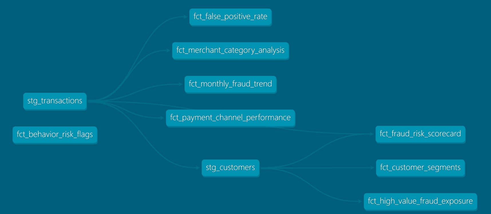

# UAE FinPay — Payment Analytics & Fraud Risk Intelligence Engine

UAE FinPay is a fictional company created for this portfolio to simulate a real-world fraud analytics use case for a UAE fintech.

---

## Executive Summary

This project builds a SQL-based fraud detection and payment analytics pipeline for a UAE fintech, inspired by the fraud monitoring and AML/CFT expectations of the UAE financial sector. Using PostgreSQL, dbt, and Python, the project transforms the IEEE-CIS Fraud Detection dataset into business-ready analytical models that support fraud operations, payment risk monitoring, customer segmentation, and executive reporting.

The solution consists of 8 dbt mart models that answer key fraud analytics questions, including customer risk scoring, payment channel performance, merchant risk concentration, monthly fraud trends, and behavior-based fraud indicators.

## Key Findings

- Top 20% of customers account for 89.69% of total fraud exposure, indicating significant concentration risk.
- Bank Transfer records the highest fraud rate in Abu Dhabi (8.14%) compared with Wallet (7.40%), challenging the assumption that card payments are always the highest-risk channel.
- The HIGH_VALUE customer segment records 7,175 fraud transactions compared with 825 for the STANDARD segment.
- Ecommerce merchants represent the highest fraud concentration across merchant categories.
- Structuring and transaction velocity patterns are identified using rule-based behavioural detection aligned with UAE AML monitoring principles.

Built for fraud analytics, payment risk operations, and AML-adjacent roles in UAE fintechs and banks.

---

## Business Problem

A payment platform processing thousands of daily card, wallet, and bank transfer transactions requires more than transaction-level fraud flags. Fraud teams need to understand:

- Which customers present the greatest fraud exposure.
- Which payment channels generate the highest fraud rates.
- Whether fraud is concentrated within particular customer segments.
- Which merchant categories require stronger monitoring.
- How fraud trends evolve over time.
- Which behavioural patterns require escalation for investigation.

Without these insights, fraud investigations become reactive, resources are allocated inefficiently, and reporting becomes descriptive rather than risk-driven. This project addresses those challenges by building a SQL-powered analytics layer that supports operational fraud monitoring and executive decision-making.

---

## Data Lineage


Raw Layer (IEEE-CIS Fraud Detection — Kaggle)

↓

UAE Staging Layer (AED conversion, emirate, KYC, escalation flags)

↓

dbt Staging Models (stg_transactions, stg_customers)

↓

dbt Mart Models (8 analytical models with dbt tests)

↓

GitHub (version controlled, documented, tested)


---

## Tech Stack

- **PostgreSQL 17** (relational database for transaction data)
- **dbt Core 1.11** (transformation, testing, documentation)
- **Python 3.12** (data preparation: `prepare_data.py`)
- **GitHub** (version control, CI/CD, project documentation)

---

## Success Metrics (KPIs)

| KPI | Description | Business Use |
|---|---|---|
| Customer Risk Score | Fraud risk score (0–100) | Prioritise investigations |
| Fraud Exposure by Segment | Fraud exposure by customer segment | Identify concentration risk |
| Fraud Rate by Channel | Fraud % for Card, Wallet & Bank Transfer | Channel optimisation |
| False Positive Rate | Legitimate transactions incorrectly flagged | Improve detection quality |
| Monthly Fraud Rate | Month-on-month fraud trend | Executive reporting |
| Merchant Fraud Rate | Fraud concentration by merchant category | Merchant risk monitoring |
| Structuring Alerts | Transactions just below reporting thresholds | AML investigation support |
| Velocity Alerts | High-frequency transaction anomalies | Early fraud detection |

---

## Key Models

| Model | Business Question |
|-------|------------------|
| `fct_fraud_risk_scorecard` | What is the risk score (0-100) for each customer? |
| `fct_false_positive_rate` | What is the fraud model accuracy by payment channel? |
| `fct_customer_segments` | How should customers be tiered by activity and value? |
| `fct_high_value_fraud_exposure` | What is the fraud concentration in premium customer segments? |
| `fct_payment_channel_performance` | How does fraud rate compare to revenue by channel? |
| `fct_monthly_fraud_trend` | What is the MoM fraud rate change using LAG window function? |
| `fct_merchant_category_analysis` | Which merchant categories have highest fraud risk? |
| `fct_behavior_risk_flags` | What behavior-based patterns indicate fraud per CBUAE 2026 guidance? |

---

## Model Details

### 1. Fraud Risk Scorecard (`fct_fraud_risk_scorecard`)

- **Purpose:** Assign risk score (0-100) to each customer based on transaction patterns, velocity, and historical fraud flags
- **Key Metrics:** Risk score, risk tier (Low/Medium/High), transaction count, total amount
- **Business Use:** Prioritize high-risk accounts for enhanced monitoring and manual review

### 2. False Positive Rate Analysis (`fct_false_positive_rate`)

- **Purpose:** Calculate fraud model accuracy by payment channel (card, wallet, bank transfer)
- **Key Metrics:** Precision, recall, false positive rate by channel
- **Business Use:** Identify channels where model underperforms and requires rule tuning

### 3. Customer Segmentation (`fct_customer_segments`)

- **Purpose:** Tier customers by activity level and value (STANDARD, HIGH_VALUE, VIP)
- **Key Metrics:** Segment assignment, transaction frequency, average transaction value
- **Business Use:** Tailor fraud monitoring intensity by customer tier

### 4. High-Value Fraud Exposure (`fct_high_value_fraud_exposure`)

- **Purpose:** Quantify fraud concentration in premium customer segments
- **Key Metrics:** Fraud transactions by segment, fraud exposure in AED, segment-level fraud rate
- **Business Use:** Justify enhanced monitoring for high-value customers (89.69% of fraud exposure in top 20%)

### 5. Payment Channel Performance (`fct_payment_channel_performance`)

- **Purpose:** Analyze fraud rate vs revenue by payment channel and emirate
- **Key Metrics:** Fraud rate, revenue, fraud-to-revenue ratio by channel (card/wallet/bank transfer)
- **Business Use:** Identify high-risk channels (e.g., bank transfer 8.14% fraud rate in Abu Dhabi)

### 6. Monthly Fraud Trend (`fct_monthly_fraud_trend`)

- **Purpose:** Track MoM fraud rate changes using LAG window function
- **Key Metrics:** Monthly fraud rate, MoM change (%), trend direction (increasing/decreasing)
- **Business Use:** Executive dashboards, regulatory reporting, early warning system

### 7. Merchant Category Analysis (`fct_merchant_category_analysis`)

- **Purpose:** Rank merchant categories by fraud concentration
- **Key Metrics:** Fraud rate, fraud count, total transactions by category (ecommerce, retail, travel, etc.)
- **Business Use:** Targeted rule tuning for high-risk categories (ecommerce shows highest fraud concentration)

### 8. Behavior Risk Flags (`fct_behavior_risk_flags`)

- **Purpose:** Flag behavior-based fraud patterns per CBUAE 2026 guidance
- **Key Metrics:** Structuring flag (multiple transactions just below thresholds), velocity anomaly flag, unusual time/location flag
- **Business Use:** Compliance with CBUAE behavior-based detection mandates, SAR/STR escalation triggers

---

## Business Impact

The outputs of this project support fraud teams in making faster, more targeted operational decisions. Customer-level risk scoring helps prioritise review effort toward the highest-risk accounts, while segment-level exposure analysis challenges the assumption that premium customers are inherently low risk. Channel-level performance insights show where fraud controls need to be tuned by payment method and emirate rather than applied as blanket rules. Merchant category analysis highlights where verification steps should be strengthened, especially in high-concentration ecommerce flows. Behaviour-based detection adds a defensible layer for identifying structuring patterns and escalation candidates, supporting more consistent fraud monitoring and regulatory reporting.

---

## Business Recommendations

- Move the top 20% of customers by fraud exposure to enhanced or continuous monitoring, while keeping the remainder on standard review cycles. This is a resourcing reallocation, not just a reporting flag.
- Scope the bank transfer rule review to Abu Dhabi specifically. A blanket “bank transfer is risky” policy would over-flag Dubai and Sharjah transactions that do not show the same pattern.
- Retire the “VIP customer = low risk” assumption in underwriting and onboarding policy. The 8.7x fraud volume gap in the HIGH_VALUE segment argues for equal or greater scrutiny at that tier.
- Route structuring-flagged transactions to manual SAR/STR review rather than automatic decline, consistent with CBUAE’s treatment of these as investigation triggers, not hard blocks.
- Use the ecommerce concentration finding to justify a targeted step-up authentication rule above a defined AED threshold, rather than a blanket restriction on the category.

---

## Limitations

- Underlying data is IEEE-CIS Fraud Detection (Kaggle), with a synthetic UAE staging layer applied through AED conversion, emirate distribution, KYC/escalation flags. It does not reflect real production transaction history or actual fraud outcomes.
- The pipeline is batch-based through dbt runs, so it supports retrospective analysis and reporting rather than real-time in-transaction blocking.
- Risk scores are rule- and pattern-based, not model-driven, so they will not adapt to new fraud patterns without manual rule updates.
- The false-positive-rate model relies on the source dataset’s fraud labels; a production system would need investigation outcomes fed back in to keep that metric accurate over time.
- No device fingerprinting, IP/geolocation, or credit bureau (AECB) signals are incorporated, all of which a production CBUAE-compliant system would typically use.

---

## Project Structure

```
uae-finpay-fraud-risk-sql/
├── README.md
├── COMPLIANCE.md
├── data_dictionary.md
├── prepare_data.py
├── lineage.png
├── .gitignore
└── uae_finpay_fraud_risk/
    ├── dbt_project.yml
    └── models/
        ├── staging/
        │   ├── stg_transactions.sql
        │   ├── stg_customers.sql
        │   └── schema.yml
        └── marts/
            ├── fct_fraud_risk_scorecard.sql
            ├── fct_false_positive_rate.sql
            ├── fct_customer_segments.sql
            ├── fct_high_value_fraud_exposure.sql
            ├── fct_payment_channel_performance.sql
            ├── fct_monthly_fraud_trend.sql
            ├── fct_merchant_category_analysis.sql
            └── fct_behavior_risk_flags.sql
```


---

## Data Quality

- **Dataset:** IEEE-CIS Fraud Detection (Kaggle) — 590,000+ transactions
- **UAE Staging Layer:** Adds AED conversion, emirate assignment, KYC flags, internal escalation triggers (AED 40k/100k)
- **dbt Testing:** Unique key constraints, non-null checks, referential integrity, accepted values
- **Data Preparation:** Python script (`prepare_data.py`) handles raw data cleaning and UAE-specific transformations

---

## Regulatory Framework

See [`COMPLIANCE.md`](COMPLIANCE.md) for full CBUAE 2026 regulatory references including:

- **Federal Decree-Law No. (10) of 2025** — Primary AML/CFT/CPF legislation
- **Cabinet Resolution No. (134) of 2025** — Executive Regulations (SAR/STR reporting, consumer protection)
- **CBUAE AML/CFT/CPF Guidance Package — April 2026**
  - TBML (Trade-Based Money Laundering) — first standalone guidance
  - PF (Proliferation Financing) — mandatory standalone risk assessment
  - Dynamic CDD — continuous monitoring, not one-time onboarding
  - Behavioral detection mandates — structuring, velocity anomalies, unusual patterns
- **goAML Portal** — UAE Financial Intelligence Unit (FIU) reporting channel
- **PDPL (UAE Data Protection Law)** — Data minimization, purpose limitation, storage limitation, cross-border transfer (Azure UAE region)

---

## dbt Lineage Diagram



> **Note:** The lineage diagram shows data flow from raw IEEE-CIS data → UAE staging layer → dbt staging models → 8 mart models. Generated via `dbt docs generate` and exported as PNG.

---


## GitHub

[View Repository](https://github.com/KunalFinData/uae-finpay-fraud-risk-sql)

## LinkedIn

[Connect on LinkedIn](https://www.linkedin.com/in/kunalsharma0425)

---

